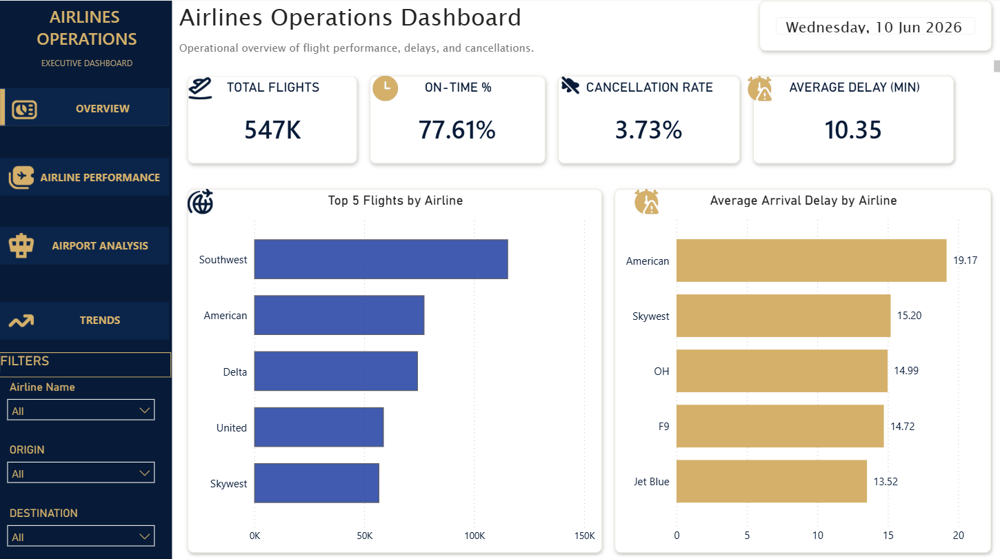
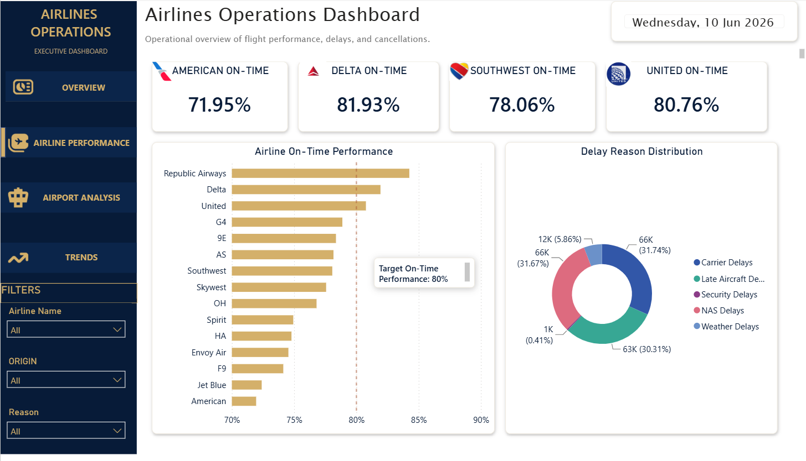
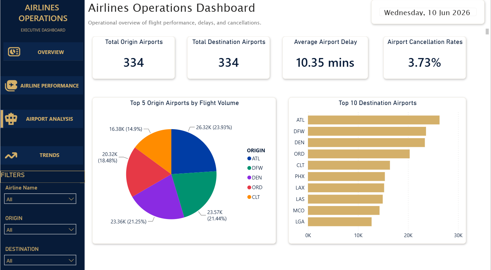
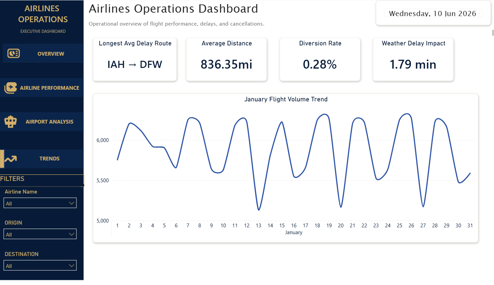

# ✈️ Airline Operations Dashboard

Interactive Power BI dashboard analyzing airline operations, delays, airport activity, and flight trends.

## 📊 Dashboard Pages

### Overview

### Airline Performance

### Airport Analysis

### Trends & Forecasting

---

## 🚀 Features

- Executive KPI Overview
- Airline On-Time Performance Analysis
- Airport Activity & Flight Volume Analysis
- Delay & Cancellation Monitoring
- Flight Trend Forecasting
- Interactive Filtering by Airline, Origin, and Destination

---

## 🛠 Tools Used

- Power BI
- DAX
- Power Query
- GitHub

---

## 📈 Key Metrics

- Total Flights
- On-Time Percentage
- Cancellation Rate
- Average Delay
- Airport Flight Volume
- Diversion Rate
- Weather Delay Impact

---

Created by **Nischaya Shrestha**
